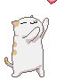
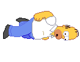
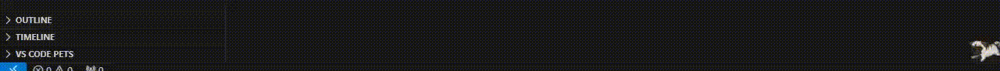

 
  

### Pet-Desktop — это приложение, которое позволяет пользователям выбирать и наблюдать за виртуальными питомцами, двигающимися по экрану. Питомцы могут быть различными анимированными персонажами, такими как "Мопс", "Пикачу", "Пингвин", "Котик" и другие. Приложение предназначено для развлечения и добавления элемента веселья в повседневную работу за компьютером.

Основные функции:
- Выбор питомца: Пользователи могут выбрать питомца из списка доступных персонажей.
- Настройка скорости: Пользователи могут регулировать скорость движения питомца.
- Интерактивность: Питомцы реагируют на действия пользователя, такие как наведение курсора и нажатие клавиш.
- Поведение питомцев: Некоторые питомцы имеют уникальное поведение
---
pip install -r requirements.txt

run select_pet.py

press 'q' to exit

